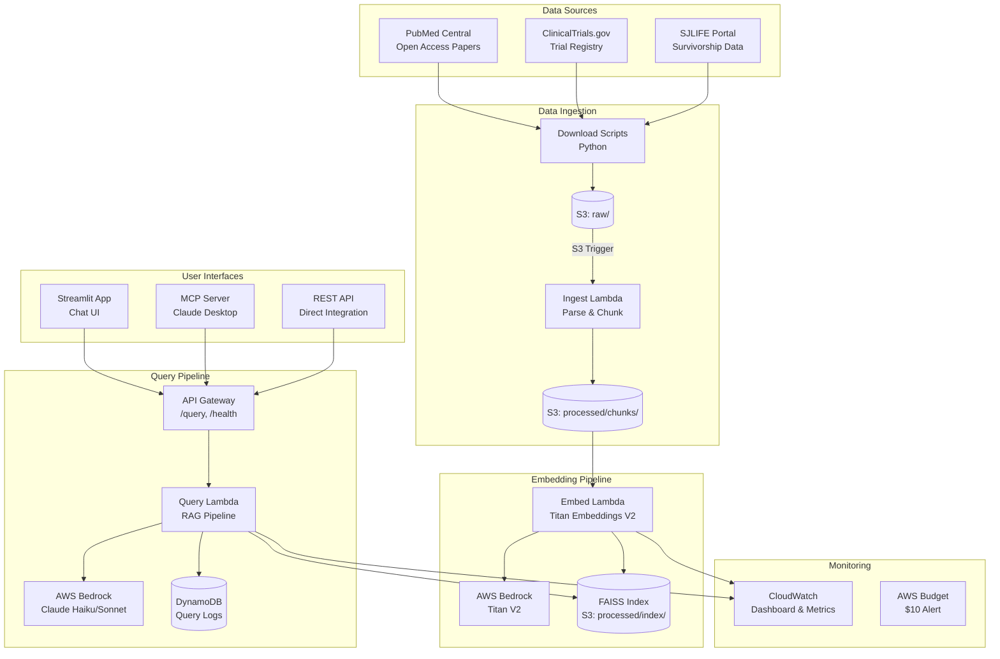
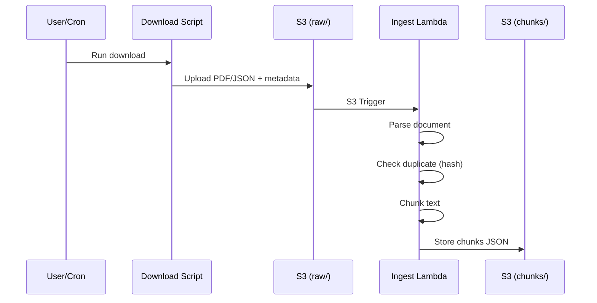
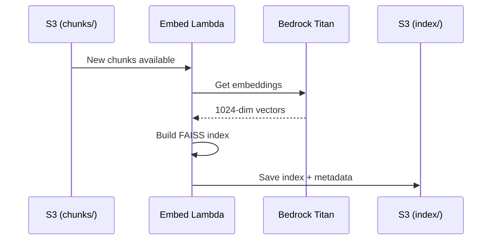
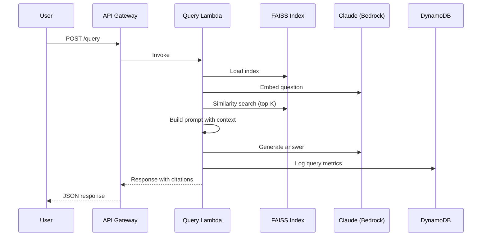

# System Architecture

## High-Level Architecture



## Data Flow

### 1. Ingestion Flow



### 2. Embedding Flow



### 3. Query Flow



## Component Details

### Lambda Functions

| Function | Trigger | Memory | Timeout | Purpose |
|----------|---------|--------|---------|---------|
| ingest | S3 upload | 1024 MB | 5 min | Parse & chunk documents |
| embed | Manual/scheduled | 2048 MB | 10 min | Generate embeddings, build index |
| query | API Gateway | 1024 MB | 2 min | RAG query pipeline |
| documents | API Gateway | 512 MB | 1 min | List/get documents |
| health | API Gateway | 256 MB | 30 sec | Health check |

### S3 Structure

```
pediatric-research-rag/
├── raw/
│   ├── papers/
│   │   ├── PMC12345.pdf
│   │   └── PMC12345_metadata.json
│   └── trials/
│       └── NCT01234567.json
├── processed/
│   ├── chunks/
│   │   ├── PMC12345_chunks.json
│   │   └── NCT01234567_chunks.json
│   └── index/
│       ├── faiss_index.bin
│       └── faiss_metadata.json
```

### API Endpoints

| Endpoint | Method | Rate Limit | Description |
|----------|--------|------------|-------------|
| /query | POST | 5/sec | RAG question answering |
| /documents | GET | 5/sec | List all documents |
| /documents/{id} | GET | 5/sec | Get document details |
| /health | GET | 5/sec | System health check |

## Security

- API Gateway: No authentication (public demo)
- Rate limiting: 5 req/sec (burst: 10)
- Budget alert: $10/month
- No PII/PHI in demo data (public papers only)

## Scalability Notes

Current design handles demo scale (~30 docs, ~50 queries/day).

For production scale:
- Replace FAISS with managed vector DB (OpenSearch, Pinecone)
- Add API Gateway authentication (Cognito, API keys)
- Implement request queuing for burst traffic
- Add CloudFront caching for document retrieval
